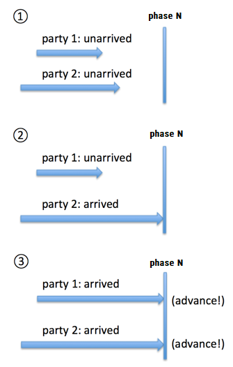
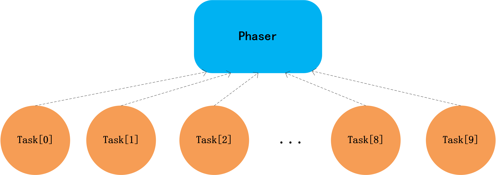
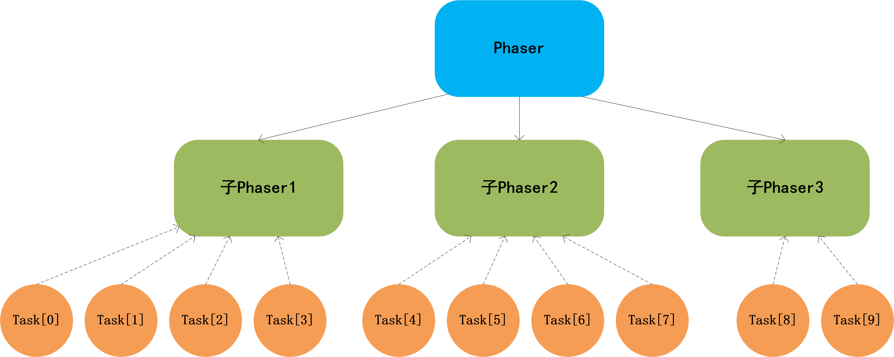

<style>
@import url('https://fonts.googleapis.com/css2?family=Noto+Sans+TC:wght@100;400;500&display=swap');
@import url('https://fonts.googleapis.com/css2?family=Noto+Sans+SC:wght@100;400;500&display=swap');
@import url('https://fonts.googleapis.com/css2?family=JetBrains+Mono:wght@100&display=swap');
section {
    font-family: 'Noto Sans TC','Noto Sans SC',-apple-system,BlinkMacSystemFont,'Segoe UI',Helvetica,Arial,sans-serif,'Apple Color Emoji','Segoe UI Emoji';
    font-weight: 100;
}
section strong {
    font-weight: 400;
}
section h1 {
    font-weight: 500;
}
section code {
    font-family: 'JetBrains Mono',SFMono-Regular,Consolas,Liberation Mono,Menlo,monospace;
    font-weight: 100;
}
img[alt~="center_horizontal"] {
    display: block;
    margin: 0 auto;
    padding: 10px;
    border: 1px solid #555;
    border-radius: 10px;
}
</style>

<style scoped>
section {
    justify-content: center;
}
h1 {
    text-align: center;
    font-size: 3em;
}
p {
    text-align: center;
    font-size: 1em;
}
</style>

# JUC Synchronizers

2022-10-05
Wayne Yang

---
<!-- paginate: true -->

<style>
section {
    justify-content: flex-start;
}
</style>

# What is JUC?

Package `java.util.concurrent`.

Utility classes commonly useful in concurrent programming.

1. `java.util.concurrent.locks` : `ReentrantLock`, ...
2. `java.util.concurrent.atomic` : `AtomicReference<T>`, ...
3. Executors : `ThreadPoolExecutor`, `ForkJoinPool`, ...
4. Queues : `LinkedBlockingQueue`, `SynchronousQueue`, `DelayQueue`, ...
5. Timing : `TimeUnit`
6. Synchronizers : ***going to introduce***
7. Concurrent Collections : `ConcurrentHashMap`, `CopyOnWriteArrayList`, ...

---

# Synchronizers

Five classes aid common special-purpose synchronization idioms.
1. `Semaphore` since 1.5
1. `CountDownLatch` since 1.5
1. `CyclicBarrier` since 1.5
1. `Phaser` since 1.7
1. `Exchanger` since 1.5

---

# Semaphore

A counting semaphore. Conceptually, a semaphore maintains a set of permits.

Each `acquire()` blocks if necessary until a permit is available, and then takes it.

Each `release()` adds a permit, potentially releasing a blocking acquirer.

However, no actual permit objects are used; the `Semaphore` just keeps a count of the number available and acts accordingly.

Semaphores are often used to restrict the number of threads than can access some (physical or logical) resource.

---

<style scoped>
section {
    display: flex;
    flex-direction: row;
    justify-content: space-between;
}
section>:first-child {
    height: 100%;
    width: 55%;
}
section>:last-child {
    height: 100%;
    width: 45%;
    margin-left: 10px !important;
}
</style>

```java
class Pool {
    private static final int N = 100;

    final Semaphore available = new Semaphore(N, true);

    public Object getItem() throws InterruptedException {
        available.acquire();
        return getNextAvailableItem();
    }

    public void putItem(Object x) {
        if (markAsUnused(x)) {
            available.release();
        }
    }

    final Object[] items = new Object[N];
    final boolean[] used = new boolean[N];

    synchronized Object getNextAvailableItem() { ... }
    synchronized boolean markAsUnused(Object item) { ... }
}

```

```java
synchronized Object getNextAvailableItem() {
    for (int i = 0; i < N; ++i) {
        if (!used[i]) {
            used[i] = true;
            return items[i];
        }
    }
    return null; // not reached
}

synchronized boolean markAsUnused(Object item) {
    for (int i = 0; i < N; ++i) {
        if (item == items[i] && used[i]) {
            used[i] = false;
            return true;
        }
    }
    return false;
}

```

---

# CountDownLatch

A synchronization aid that allows one or more threads to wait until a set of operations being performed in other threads completes.

This is a one-shot phenomenon -- the count cannot be reset. If you need a version that resets the count, consider using a `CyclicBarrier`.

A `CountDownLatch` initialized to *N* can be used to make one thread wait until *N* threads have completed some action, or some action has been completed *N* times.

---

<style scoped>
section {
    padding-top: 40px;
}
</style>

Example 1:

```java
class Driver1 {
    void main() throws InterruptedException {
        CountDownLatch doneSignal = new CountDownLatch(N);
        Executor executor = Executors.newFixedThreadPool(N);

        for (int i = 0; i < N; ++i) { // create and start threads
            executor.execute(new WorkerRunnable(doneSignal, i));
        }

        doneSignal.await();           // wait for all to finish
    }
}

class WorkerRunnable implements Runnable {
    private final CountDownLatch doneSignal;
    private final int i;

    WorkerRunnable(CountDownLatch doneSignal, int i) {
        this.doneSignal = doneSignal;
        this.i = i;
    }

    public void run() {
        try {
            doWork(i);
            doneSignal.countDown();
        } catch (InterruptedException ex) {
        }
    }
}

```

---

<style scoped>
section {
    padding-top: 40px;
}
</style>

Example 2:

```java
class Driver2 {
    void main() throws InterruptedException {
        CountDownLatch startSignal = new CountDownLatch(1);
        CountDownLatch doneSignal = new CountDownLatch(N);

        for (int i = 0; i < N; ++i)   // create and start threads
            new Thread(new Worker(startSignal, doneSignal)).start();

        doSomething();                // don't let run yet
        startSignal.countDown();      // let all threads proceed
        doSomethingElse();
        doneSignal.await();           // wait for all to finish
    }
}

class Worker implements Runnable {
    private final CountDownLatch startSignal;
    private final CountDownLatch doneSignal;
    Worker(CountDownLatch startSignal, CountDownLatch doneSignal) {
        this.startSignal = startSignal;
        this.doneSignal = doneSignal;
    }
    public void run() {
        try {
            startSignal.await();
            doWork();
            doneSignal.countDown();
        } catch (InterruptedException ex) {}
    }
}

```

---

# CyclicBarrier

A synchronization aid that allows a set of threads to all wait for each other to reach a common barrier point.

CyclicBarriers are useful in programs involving a fixed sized party of threads that must occasionally wait for each other.

The barrier is called *cyclic* because it can be re-used after the waiting threads are released.

A `CyclicBarrier` supports an optional `Runnable` command that is run once per barrier point, after the last thread in the party arrives, but before any threads are released. This barrier action is useful for updating shared-state before any of the parties continue.

---

<style scoped>
section {
    display: flex;
    flex-direction: row;
    justify-content: space-between;
}
section>:first-child {
    height: 100%;
    width: 52%;
}
section>:last-child {
    height: 100%;
    width: 48%;
    margin-left: 10px !important;
}
</style>

```java
class Solver {
    final int N;
    final float[][] data;
    final CyclicBarrier barrier;

    class Worker { ... }

    Solver(float[][] matrix) {
        data = matrix;
        N = matrix.length;
        Runnable barrierAction =
            () -> { mergeRows(...); };
        barrier = new CyclicBarrier(N, barrierAction);

        List<Thread> threads = new ArrayList<>(N);
        for (int i = 0; i < N; i++) {
            Thread thread =
                new Thread(new Worker(barrier, i));
            threads.add(thread);
            thread.start();
        }

        // wait until done
        for (Thread thread : threads)
            thread.join();
    }
}

```

```java
class Worker implements Runnable {
    final CyclicBarrier barrier;
    final int row;
    
    Worker(CyclicBarrier barrier, int row) {
        this.barrier = barrier;
        this.row = row;
    }

    @Override
    public void run() {
        while (!done()) {
            processRow(row);

            try {
                barrier.await();
            } catch (InterruptedException ex) {
                return;
            } catch (BrokenBarrierException ex) {
                return;
            }
        }
    }
}

```

---

# Phaser

A reusable synchronization barrier, similar in functionality to `CyclicBarrier` and `CountDownLatch` but supporting more flexible usage.



---

 - Unlike the case for other barriers, the number of parties registered to synchronize on a phaser may vary over time. Tasks may be registered at any time, and optionally deregistered upon any arrival.

 - Each generation of a phaser has an associated phase number. The phase number starts at zero, and advances when all parties arrive at the phaser, wrapping around to zero after reaching `Integer.MAX_VALUE`.

 - A phaser may enter a termination state. Termination is triggered when an invocation of `onAdvance` returns `true`. The default implementation returns `true` if a deregistration has caused the number of registered parties to become zero. Method `forceTermination()` is also available to abruptly release waiting threads and allow them to terminate.

---

 - Phasers may be *tiered* to reduce contention. Phasers with large numbers of parties that would otherwise experience heavy synchronization contention costs may instead be set up so that groups of sub-phasers share a common parent.





---

<style scoped>
marp-pre {
    padding-right: 310px !important;
}
</style>

A `Phaser` may be used instead of a `CountDownLatch` to control a one-shot action serving a variable number of parties. The typical idiom is for the method setting this up to first register, then start the actions, then deregister, as in:

```java
void runTasks(List<Runnable> tasks) {
    final Phaser phaser = new Phaser(1); // "1" to register self
    // create and start threads
    for (final Runnable task : tasks) {
        phaser.register();
        new Thread() {
            public void run() {
                phaser.arriveAndAwaitAdvance(); // await all creation
                task.run();
            }
        }.start();
    }
    // allow threads to start and deregister self
    phaser.arriveAndDeregister();
}

```

---

<style scoped>
marp-pre {
    padding-right: 300px !important;
}
</style>

One way to cause a set of threads to repeatedly perform actions for a given number of iterations is to override `onAdvance`:

```java
void startTasks(List<Runnable> tasks, final int iterations) {
    final Phaser phaser = new Phaser() {
        protected boolean onAdvance(int phase, int registeredParties) {
            return phase >= iterations || registeredParties == 0;
        }
    };
    phaser.register();
    for (final Runnable task : tasks) {
        phaser.register();
        new Thread(() -> {
            do {
                task.run();
                phaser.arriveAndAwaitAdvance();
            } while (!phaser.isTerminated());  
        }).start();
    }
    while (!phaser.isTerminated())
        phaser.arriveAndAwaitAdvance();
}

```

---

<style scoped>
marp-pre {
    padding-right: 300px !important;
}
</style>

Related constructions may be used to await particular phase numbers in contexts where you are sure that the phase will never wrap around `Integer.MAX_VALUE`. For example:

```java
void awaitPhase(Phaser phaser, int phase) {
    int p = phaser.register(); // assumes caller not already registered
    while (p < phase) {
        if (phaser.isTerminated())
            // ... deal with unexpected termination
        else
            p = phaser.arriveAndAwaitAdvance();
    }
    phaser.arriveAndDeregister();
}

```

---

<style scoped>
marp-pre {
    padding-right: 460px !important;
}
</style>

To create a set of `n` tasks using a tree of phasers, you could use code of the following form, assuming a Task class with a constructor accepting a `Phaser` that it registers with upon construction. After invocation of `build(new Task[n], 0, n, new Phaser())`, these tasks could then be started, for example by submitting to a pool:

```java
void build(Task[] tasks, int lo, int hi, Phaser ph) {
    if (hi - lo > TASKS_PER_PHASER) {
        for (int i = lo; i < hi; i += TASKS_PER_PHASER) {
            int j = Math.min(i + TASKS_PER_PHASER, hi);
            build(tasks, i, j, new Phaser(ph));
        }
    } else {
        for (int i = lo; i < hi; ++i) {
            tasks[i] = new Task(ph);
        }
        // assumes new Task(ph) performs ph.register()
    }
}

```

---

# Exchanger

A synchronization point at which threads can pair and swap elements within pairs.

---

```java
class FillAndEmpty {
    Exchanger<DataBuffer> exchanger = new Exchanger<DataBuffer>();

    class FillingLoop implements Runnable {
        public void run() {
            DataBuffer currentBuffer = initialEmptyBuffer;
            try {
                while (currentBuffer != null) {
                    fillBuffer(currentBuffer);
                    currentBuffer = exchanger.exchange(currentBuffer);
                }
            } catch (InterruptedException ex) { ... }
        }
    }

    class EmptyingLoop implements Runnable {
        public void run() {
            DataBuffer currentBuffer = initialFullBuffer;
            try {
                while (currentBuffer != null) {
                    drainBuffer(currentBuffer);
                    currentBuffer = exchanger.exchange(currentBuffer);
                }
            } catch (InterruptedException ex) { ... }
        }
    }
}

```

---

# References
 - [java.util.concurrent (Java Platform SE 8 )](https://docs.oracle.com/javase/8/docs/api/java/util/concurrent/package-summary.html)
 - [java - Java多线程进阶（二二）—— J.U.C之synchronizer框架：Phaser_个人文章 - SegmentFault 思否](https://segmentfault.com/a/1190000015979879)
